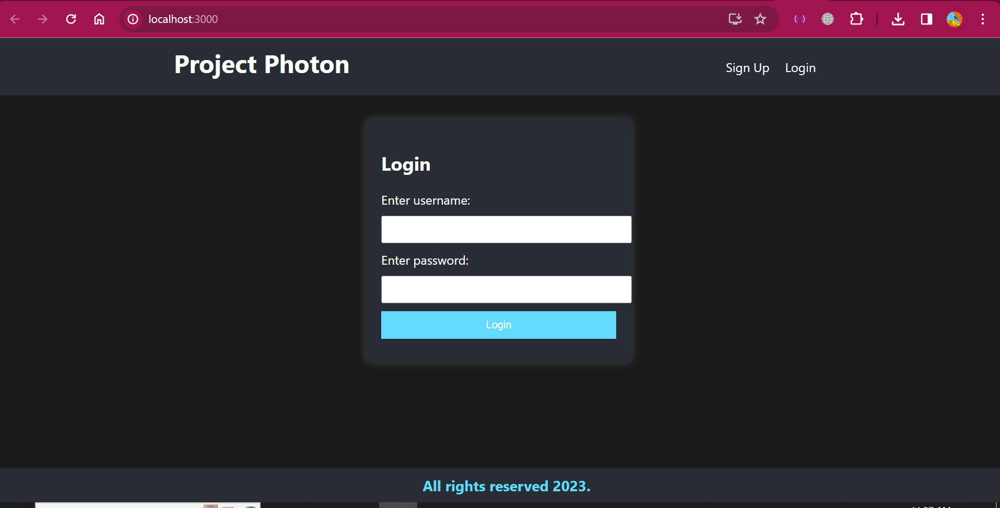
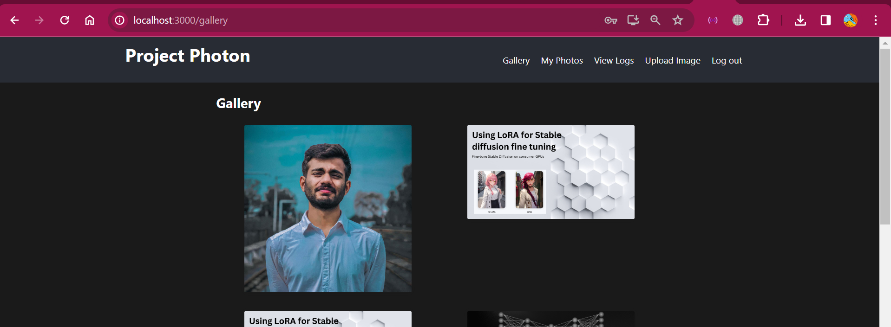
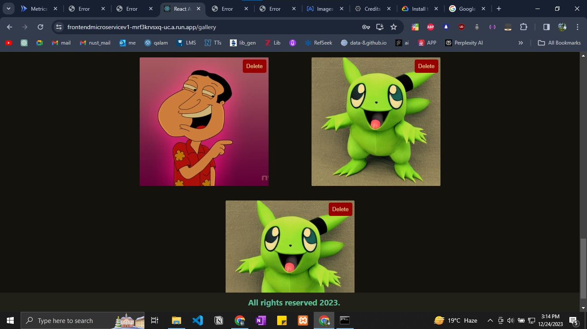
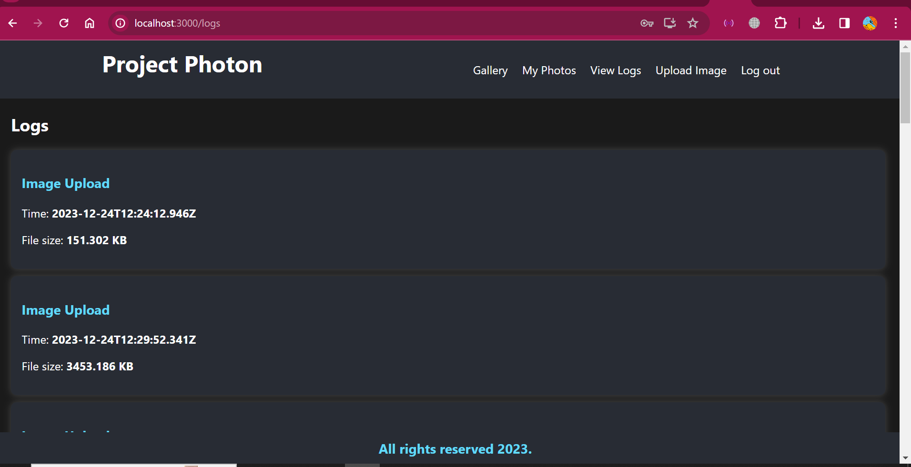
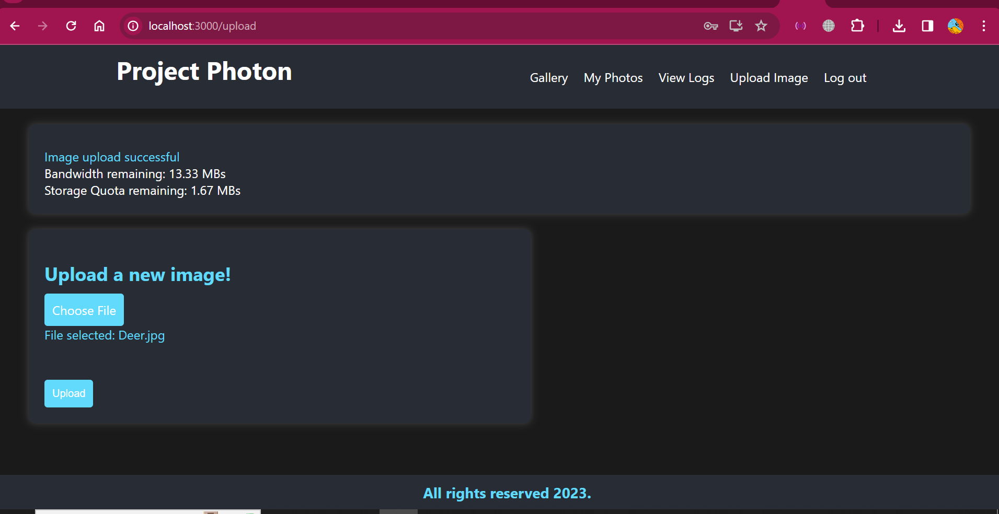

# Project Photon - The Google photos clone

A microservices-based photo gallery application designed for image upload with usage and storage monitoring. Developed using the MERN stack (MongoDB, Express.js, React.js, Node.js), the application is structured as separate microservices to enhance scalability and maintainability.

## Features

- **User Account Management:** Users can simply register and start using our application.
- **Image Upload:** Users can easily upload images using the application.
- **Image Delete:** Users can delete individual images.
- **Bulk Delete:** Users can delete their images in bulk.
- **Logging:** Tracks the activity of users.
- **Usage Monitoring:** The application provides metrics for monitoring usage patterns.
- **Storage Monitoring:** Tracks and displays storage usage for the uploaded images.

## Architecture

The microservices architecture promotes a modular and scalable design:

- **Client (React.js):** Provides the user interface.
- **Other Microservices (Node.js):** Includes services for user authentication, user activity monitoring, and storage monitoring.

## Architectural Diagram

## Application

### Landing page

### Gallery

### User photos page

### User activity page

### Upload images page

## Load testing cases
Tests invoked on frontend microservice
### 100 users, 2 sec ramp-up period, 10 iterations
Throughput increased without any failure

### 500 users, 2 sec ramp-up period, 50 iterations
25k requests were successfully served. Throughput 21.7/s, Spike was measured on gcp

### 500 users, 2 sec ramp-up period, 100 iterations
~50k requests were 100% served. Throughput 29.3/s

